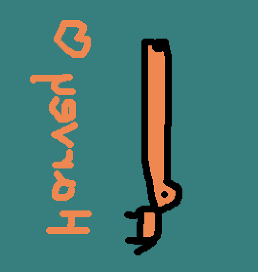

# Workshop

## Choix de structuration du code

- J'ai placé mes fonctions de traitement des images dans un fichier à part nommé image-utils, pour en faire une sorte de librairie d'effets réutilisables applicables sur des images.
- Les fonctions que j'ai placé dans image-utils transforment directement l'image qui leur est passée en paramètre (pas besoin de réassigner une image, elles retournent void).
- J'ai une fonction pngs_to_gif qui lance une commande système via la fonction c++ system()). Elle est basée sur l'outil de ligne de commande [imagemagick](https://imagemagick.org/index.php) qui permet de faire toute sortes d'effet de traitement d'image.

## Exercices

### ⭐ Ne garder que le vert

|  |  |
| ------------------------------- | -------------------------------------- |
| **Input**                       | **Output**                             |

On boucle sur chaque pixel : pour chaque pixel, on passe le rouge et le bleu à 0, donc il ne reste que le vert.

### ⭐ Échanger les canaux

|  |  |
| ------------------------------- | -------------------------------------- |
| **Input**                       | **Output**                             |

On boucle sur chaque pixel. On intervertit le rouge et le bleu en passant par une variable temporaire nommée `tmp`.

### ⭐ Noir & Blanc

|  |  |
| ------------------------------- | -------------------------------------- |
| **Input**                       | **Output**                             |

On calcule la luminosité moyenne de chaque pixel en additionnant la valeur des canaux rouges, verts et bleus, puis en la divisant par 3 (nombre de canaux). Ensuite, on attribue cette valeur à chacun des trois canaux, pour obtenir des niveaux de gris.

### ⭐ Négatif

|  |  |
| ------------------------------- | -------------------------------------- |
| **Input**                       | **Output**                             |

On boucle sur chaque pixel. Pour chaque canal de couleur, on soustrait la valeur du pixel à 1. Donc au lieu d'avoir 0.2f pour le bleu par exemple, on obtient 0.8f : c'est le négatif de l'image. 

### ⭐ Dégradé

|  |  |
| ------------------------------- | -------------------------------------- |
| **Input**                       | **Output**                             |

On boucle sur chaque pixel de l'image (comme on a besoin des positions cette fois ci, on utilise la boucle avec les positions explicites x et y). Pour faire un dégradé de droite à gauche, on utilise la position sur les x et on l'assigne à chacun des trois canaux. Si on voulait un dégradé rouge, on pourrait assigner le x au canal rouge. Si on voulait un dégradé de haut en bas, on pourrait utiliser la position y. Il faut diviser le x par la largeur de l'image pour avoir un dégradé de la bonne largeur.

### ⭐⭐ Miroir

|  |  |
| ------------------------------- | -------------------------------------- |
| **Input**                       | **Output**                             |

Pour un miroir horizontal, on boucle sur l'image et on assigne les couleurs du pixel `width - x` au pixel `x`.
Pour réussir l'effet de miroir, il faut travailler sur une "copie" de l'image et ne pas modifier directement l'image d'origine, sinon on va se baser sur des valeurs déjà modifiées une fois arrivé à la moitié de l'image (ce qui donnera un effet de symmétrie).

### ⭐⭐ Image bruitée

|  |  |
| ------------------------------- | -------------------------------------- |
| **Input**                       | **Output**                             |

Pour chaque canal de chaque pixel, on ajoute un float random entre 0.5 et -0.5 (par exemple, on peut utiliser des valeurs plus haut pour augmenter l'effet).

### ⭐⭐ Rotation de 90°

|  |  |
| ------------------------------- | -------------------------------------- |
| **Input**                       | **Output**                             |

Il faut encore une fois travailler sur une copie de l'image pour réussir cet effet. Pour faire une rotation, on peut intervertir le pixel `(x, y)` avec le pixel `(y, x)`

### ⭐⭐ RGB split

|  |  |
| ------------------------------- | -------------------------------------- |
| **Input**                       | **Output**                             |

On utilise une constante decalage `d`. Pour chaque pixel, on utilise le pixel bleu situé `d` pixels plus loin (on ajoute `d` à la position). Pour les rouges, on utilise la valeur rouge située `d` pixel plus tôt.
On ajoute des condition pour éviter de chercher des pixels hors de l'image à droite pour les rouges et à gauche pour les bleus (on fait comme si le pixel était noir).

### ⭐⭐ Luminosité

|  |  |
| ------------------------------- | -------------------------------------- |
| **Input**                       | **Output**                             |

On multiplie chaque canal de chaque pixel par un facteur brightness de type float.

### ⭐⭐ Disque

|  |  |
| ------------------------------- | -------------------------------------- |
| **Input**                       | **Output**                             |

On boucle sur tous les pixels. Si le pixel est à une distance du centre plus petite que le `radius`, alors ça signifie qu'il est dans le disque : on le colorie. Pour calculer la distance entre le centre et le pixel courant, on utilise la fonction `distance` fournie par la librairie glm.

### ⭐ Cercle

|  |  |
| ------------------------------- | -------------------------------------- |
| **Input**                       | **Output**                             |

Même chose que pour le disque, mais on ajoute une vérification dans le code pour vérifier que la distance n'est pas inférieur au `radius` moins `thickness` (ce qui voudrait dire qu'on est à l'intérieur de la partie "creuse" du disque).

### ⭐⭐ Animation| 

 |  |
| ------------------------------- | -------------------------------------- |
| **Input**                       | **Output**                             |

On réutilise la fonction cercle définie précédemment pour dessiner des cercles, sauf qu'on boucle pour générer plusieurs images en déplaçant le cercle dans l'espace sur chaque image. Un fois la génération terminée, j'appelle ma fonction pngs_to_gif pour générer un gif (nécéssite l'utilitaire en ligne de commande ImageMagick)

### ⭐⭐⭐ Rosace

|  |   |
| -------------------------------------- |  -------------------------------------- |
| **Output**                             | **Erreur** |

On commence par dessiner une cercle au centre de l'image. Ensuite, on boucle autant de fois qu'on souhaite dessiner de cercles autour de la rosace. A chaque itération, on calcule le centre du nouveau cercle autour du cercle initial avec l'angle 2 PI (tour complet du cercle) divisé par le nombre total de cercles souhaité.
Pour transformer cette coordonée polaire en coordonnée cartésienne, j'ai d'abord essayé d'utiliser la fonction glm::euclidian fournie par glm, mais sans succès (si j'ai bien compris, cette fonction sert en fait à calculer la différence entre deux coordonnées et non pas à convertir de coordonnées polaires à cartésienne comme je le pensais). A la place, j'ai utilisé un cosinus pour obtenir le x et un sinus pour obtenir le y. Ensuite, j'ajoute la coordonnée de centre du cercle initial pour positionner le nouveau cercle sur le cercle d'origine.

### ⭐⭐ Mosaïque

|  |  |
| ------------------------------- | -------------------------------------- |
| **Input**                       | **Output**                             |

Ma fonction mosaïque prend en entrée un paramètre size qui détermine combien de fois l'image d'origine sera répétée dans l'image finale. Par exemple, pour répéter l'image 4 fois, il faut récupérer un pixel sur 4 sur les axes x et y (donc on multilplie la position par 4). Puis on fait un modulo de la taille de l'image pour que l'image se répète.

### ⭐⭐⭐ Mosaïque miroir

|  |  |
| ------------------------------- | -------------------------------------- |
| **Input**                       | **Output**                             |

Même chose que pour la mosaïque classique, sauf qu'on rajoute 2 conditions, une pour chaque axe x et y. On souhaite retourner une image sur 2, donc il nous faut une condition qui se déclenche sur les bons intervalles.
```c++
if((x / (image.width() / size)) % 2 == 1) {
    pixel.x = image.width() - 1 - pixel.x;
}
```
Cette condition vérifie si la coordonnée x d'un pixel se trouve dans une colonne impaire (selon un certain intervalle défini par size). Si c'est le cas, il inverse la position x du pixel par rapport à la largeur de l'image.
Même chose pour l'axe y.

### ⭐⭐⭐ Glitch

|  |  |
| ------------------------------- | -------------------------------------- |
| **Input**                       | **Output**                             |

J'ai décidé d'utiliser un struct Glitch pour représenter chaque groupe de pixel déplacé sur l'image. Un Glitch possède des vec2 `size`, `origin` et `destination`. J'initalise des Glitch random avec une fonction random_glitch, que j'appelle autant de fois que je souhaite (pour moduler l'effet).
Ensuite, je boucle sur tous les glitchs générés pour effectuer les déplacements.

### ⭐⭐⭐ Fractale de Mandelbrot

|  |  |
| ------------------------------- | -------------------------------------- |
| **Input**                       | **Output**                             |

J'ai appliqué la formule pour l'effet mandelbrot. Pour faire varier l'intensité, j'ai utilisé le compteur d'itérations divisé par 100 (pour le ramener entre 1 et 0) pour la valeur du pixel.

### ⭐⭐⭐(⭐) Normalisation de l'histogramme

|  |  |
| ------------------------------- | -------------------------------------- |
| **Input**                       | **Output**                             |


### ⭐⭐⭐⭐⭐⭐ Diamond Square


J'ai cherché pendant un bon moment à faire fonctionner un algorithme du diamond square trouvé dans un article, puis celui en pseudo code sur l'article wikipédia mais je n'ai pas réussi. Au final, j'ai suivi étape par étape la vidéo du cours et ça a fonctionné. Le principe n'est pas très compliqué mais les boucles qui permettent de parcourir les points des diamants et des carrés sont compliquées à faire fonctionner.

Voici le processus : 

1. On génère 4 valeurs random pour les coins
2. On définit une taille de chunk (=subdivision de l'image) égale à la taille de l'image pour commencer
3. On applique la square step autant de fois qu'il y a de chunks dans l'image (1, puis 4, puis). La square step assigne la valeur moyenne des quatres coins du carré (plus une petite variation random) au point au centre du carré.
4. Ensuite, on fait la même chose pour la diamond step. On l'applique autant de fois qu'il y a de chunks à cette itération. La diamond step assigne la moyenne des pointes du diamant au centre du diamant (plus une petite variation random). Il faut aussi mettre en place une condition au cas ou l'une des pointes du diamant est hors de la heightmap (ce qui ne peut pas arriver dans la square step).
5. On divise la chunk size par 2, et la roughness par 2.
6. On répète à l'étape 3, tant que la taille du chunk est plus grande que 1.

On module la petite variation random avec un facteur `roughness` pour changer le "contraste" de la map.
Je crois qu'il y a un petit défaut aux coins de mon image, je pense qu'il vient de la condition de la diamond_step, mais je n'ai pas eu le temps de la corriger.
Pour donner un aspect de vraie map au résultat, il faudrait assigner des plages de couleurs aux intervals de gris de l'image (plus grand que 0.9 => montagne par exemple).

## Bonus

### Chien paramétrique


J'ai réutilisé ma fonction circle et une fonction rectangle pour générer un chien à base de formes